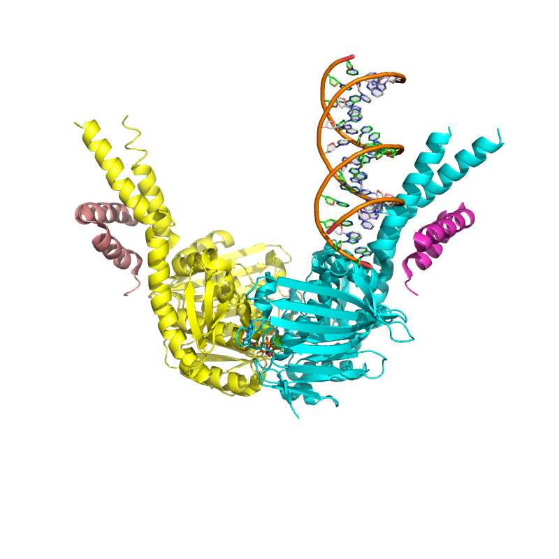

# pymol-scripts
Repository for PyMOL molecular graphics shell, PyMOL log and Python scripts 

  </img>

These are PyMOL scripts for doing a lot of common things. 

Note that there are different types of scripts:
1) PyMOL log type scripts that are run in the PyMOL command line using "@", example @make_pics.pml, these have .pml file extensions.
2) Shell scripts, these are labeled by the type of shell that is called in the first line, example .sh, .csh or .bash. These usually are called on the UNIX command line. They may have arguments.
3) Python scripts. These have extensions .py, and may be run on the UNIX command line, or in PyMOL.

Some scripts may need additional input files, requirements can be found in the file headers.
