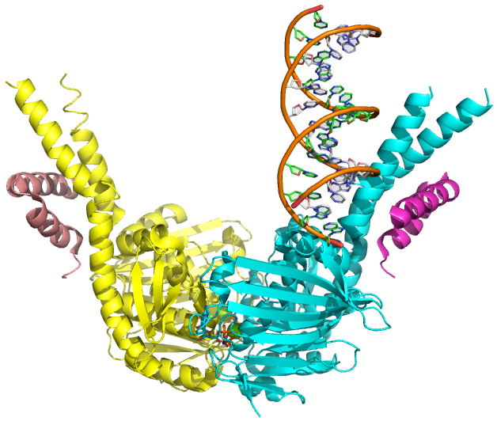

# pymol-scripts
Repository for PyMOL molecular graphics shell, PyMOL log and Python scripts 

<p align="center">
  </img>
</p>

These are PyMOL scripts for doing a lot of common things. 

Note that there are different types of scripts:
1) PyMOL log type scripts that are run in the PyMOL command line using "@", example @make_pics.pml, these have .pml file extensions.
2) Shell scripts, these are labeled by the type of shell that is called in the first line, example .sh, .csh or .bash. These usually are called on the UNIX command line. They may have arguments.
3) Python scripts. These have extensions .py, and may be run on the UNIX command line, or in PyMOL.

Some scripts may need additional input files, requirements can be found in the file headers.


## make_figures.csh
Make a quick publication quality figures of the biological (not default asymmetric unit) assembly of proteins and DNA from the Protein Data Bank using PyMOL - this is useful for when your PI asks for many images and you don't have time to spend an hour on each.


Requirements and running:
1. Ability to run PyMOL from the command-line. The .csh file builds it's own input script, and executes it, therefore you need an alias in your .cshrc. ie. for my version, I have 


```shell
###############
# pymol
###############
alias pymol /Applications/MacPyMOL.app/Contents/MacOS/MacPyMOL
```
in my `.cshrc` file

2. Using the files provided, run:
`./make_figures.csh make_figures_setup.pml make_figures_test_pdb_list`
3. Read the header of make_figures.csh for more detail
